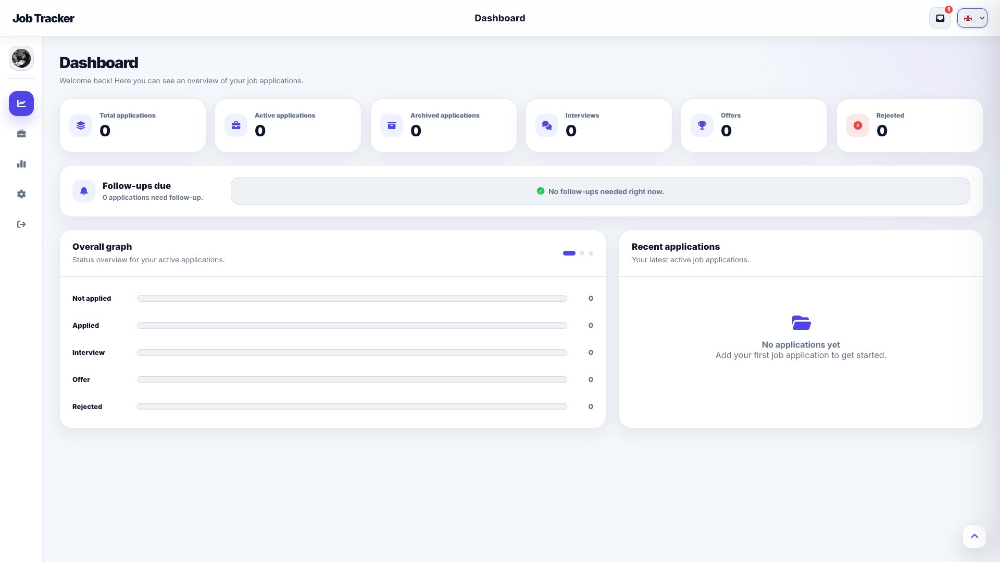
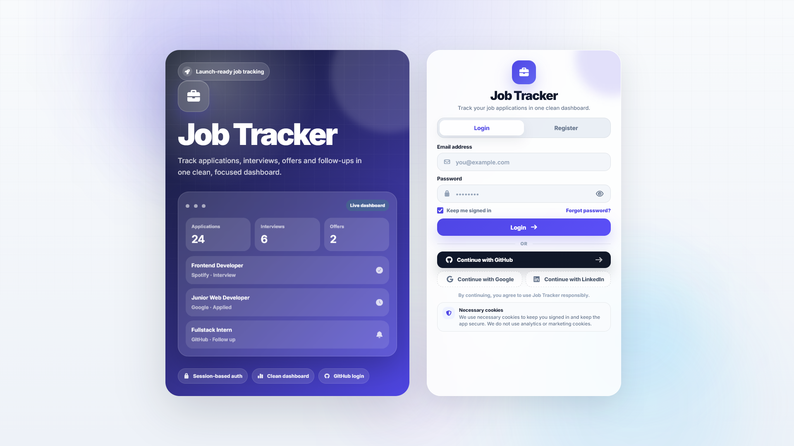
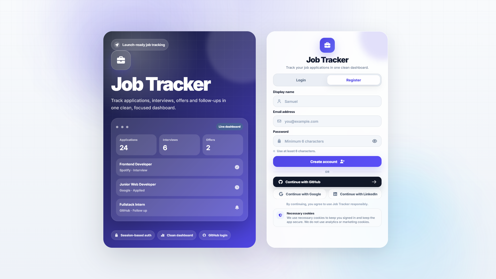
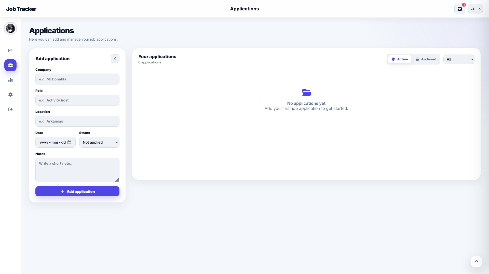
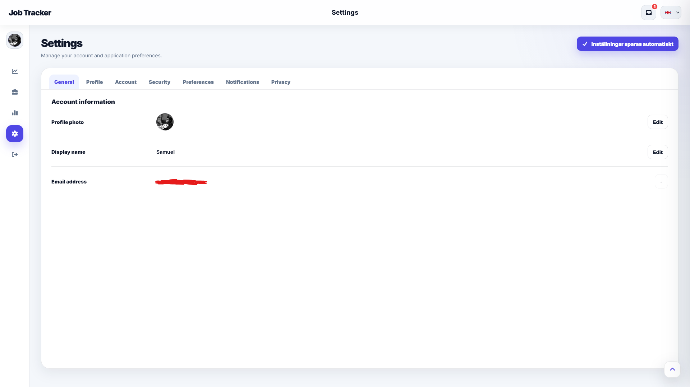

# Job Tracker

A full-stack job application tracker built with **Node.js**, **Express**, **Vanilla JavaScript**, **HTML** and **CSS**.

Job Tracker helps users organize their job search by tracking applications, statuses, archived jobs, profile settings, notifications and public user profiles. The project was built as a serious portfolio project with real authentication, protected routes, CRUD functionality and a polished dashboard-style interface.



---

## Features

* User authentication with login and registration
* Session-based auth using Express sessions
* Protected user routes
* Job application CRUD
* Application statuses:

  * Not Applied
  * Applied
  * Interview
  * Offer
  * Rejected
* Archive and restore applications
* Dashboard with application statistics
* Settings page with account and profile options
* Public user profiles
* Profile image upload
* Notification center with unread state
* Multi-language structure with JSON language files
* Responsive dashboard layout
* Dark, modern SaaS-inspired UI

---

## Screenshots

### Authentication





### Dashboard


### Applications



### Settings



### Public User Profile


---

## Tech Stack

### Frontend

* HTML
* CSS
* Vanilla JavaScript

### Backend

* Node.js
* Express
* Express Session
* Session File Store
* Passport
* GitHub OAuth
* Bcrypt
* Multer
* Zod
* Helmet
* CORS

### Storage

* JSON file-based storage for users, applications and notifications
* Local session storage using `session-file-store`

---

## Project Structure

```txt
job-tracker/
├── public/
│   ├── lang/
│   ├── app.css
│   ├── auth.css
│   ├── auth.html
│   ├── auth.js
│   ├── index.html
│   ├── profile.css
│   ├── profile.html
│   ├── profile.js
│   └── script.js
│
├── screenshots/
│   ├── applications.png
│   ├── auth_login.png
│   ├── auth_register.png
│   ├── dashboard.png
│   ├── settings.png
│   └── user_profile.png
│
├── server.js
├── package.json
├── package-lock.json
├── nodemon.json
└── .gitignore
```

---

## Getting Started

### 1. Clone the repository

```bash
git clone https://github.com/samme-commit/job-tracker.git
cd job-tracker
```

### 2. Install dependencies

```bash
npm install
```

### 3. Create a `.env` file

Create a `.env` file in the root folder:

```env
PORT=3000
SESSION_SECRET=your_session_secret_here

GITHUB_CLIENT_ID=your_github_client_id
GITHUB_CLIENT_SECRET=your_github_client_secret
GITHUB_CALLBACK_URL=http://localhost:3000/auth/github/callback

CLIENT_URL=http://localhost:3000
```

GitHub OAuth is optional for local testing, but the environment variables are needed if you want GitHub login to work.

### 4. Start the development server

```bash
npm run dev
```

Or run the production start command:

```bash
npm start
```

### 5. Open the app

```txt
http://localhost:3000
```

---

## What I Learned

This project helped me practice building a more realistic full-stack web application instead of only creating static frontend projects.

Some of the main things I worked with:

* Building a Node.js and Express backend
* Creating REST API routes
* Handling authentication with sessions
* Protecting private user data
* Validating input with Zod
* Hashing passwords with bcrypt
* Uploading profile images with Multer
* Structuring frontend code with multiple pages
* Managing UI state with Vanilla JavaScript
* Building a polished SaaS-style dashboard
* Working with JSON file-based storage
* Planning a project that can later be rebuilt with React and TypeScript

---

## Future Improvements

This is version 1 of Job Tracker.

A future version is planned as a **React + TypeScript rebuild**, focusing on:

* Reusable React components
* Better frontend structure
* Protected client-side routes
* Improved state management
* Cleaner API handling
* More scalable project architecture
* Better form validation and loading states
* Possible database integration

The goal for version 2 is to turn the original Vanilla JavaScript version into a more modern and scalable full-stack application.

---

## Version

```txt
v1.0.0
```

---

## Author

Built by **Samuel**.

GitHub: [@samme-commit](https://github.com/samme-commit)
